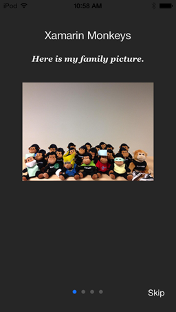

DCIntroView
===========

DCIntroView is an easy to use introduction view for Xamarin.iOS apps. It's highly customizable where you can use your own views or simply use the supplied template.

&nbsp;
&nbsp;
&nbsp;


Using the introduction view
-------
Build and add a reference to DCIntroView.dll in your project. You can also check out the Sample project in this repo.

1. Create an instance of the view controller:
```csharp
DCIntroView.IntroView introView = new IntroView();
```

2. Add your views. Note: Add views in the order you want them displayed.

	Adding a view using built in template:
	```csharp
	introView.AddViewToControllers(new TemplateView ("Xamarin Monkeys", "Here is my family picture.") {
		Image = UIImage.FromFile("Images/monkeys.png"),
		ViewBackgroundColor = UIColor.Black.ColorWithAlpha(.8f),
		DescriptionTextColor = UIColor.White,
		TitleTextColor = UIColor.White,
		TitleFont = UIFont.SystemFontOfSize(20),
		DescriptionFont = UIFont.FromName("Georgia-BoldItalic", 15),
		TitleY = (UserInterfaceIdiomIsPhone ? 50 : 100),
		DescriptionY = (UserInterfaceIdiomIsPhone ? 90 : 200),
		ImageY = (UserInterfaceIdiomIsPhone ? 150 : 300)
	}.View);
	```

	Or add your own custom view:
	```csharp
	UIView customView = new UIView (this.View.Bounds);
	int customImageWidth = 200;
	int screenWidth = (int)UIScreen.MainScreen.Bounds.Width;
	UIImageView custImg = new UIImageView(new Rectangle(screenWidth/2 - customImageWidth/2, 100, customImageWidth, 200));
	custImg.ContentMode = UIViewContentMode.ScaleAspectFit;
	custImg.Image = UIImage.FromFile("Images/monkey2.png");
	customView.AddSubview (custImg);
	customView.BackgroundColor = UIColor.FromRGBA (1.0f, 0.58f, 0.21f, 1.0f);
	
	int labelWidth = 200;
	var lbl = new UILabel(new Rectangle(screenWidth/2 - labelWidth/2, ((int)custImg.Frame.Y+(int)custImg.Frame.Height + 30), labelWidth, 40));
	lbl.Text = "This is my custom view.";
	
	customView.AddSubview (lbl);
	introView.AddViewToControllers(customView)
	```

3. Set any optional parameters:
```csharp
introView.ClearBackground = true;
introView.SetSkipButtonTitleColor(UIColor.White);
introView.SetPageIndicatorTintColor(UIColor.DarkGray);
introView.SetCurrentPageIndicatorTintColor(UIColor.FromRGB (23, 112, 255));
introView.ShowSkipButtonOnLastPage = true;
introView.SkipButtonTitle = "Skip";
introView.SetSkipButtonTitleColor(UIColor.DarkGray);
introView.SetSkipButtonAlignment = IntroView.SkipButtonAlignment.TopCenter;
```

4. Add the skip button's event handler:
```csharp
introView.SkipButtonHandler = delegate{
  // action you want
	introView.View.RemoveFromSuperview();
};
```

5. And finally display the IntroView:
```csharp
this.View.AddSubview(introView.View);
```

Class diagram<br/>


Xamarin Monkey Credits
-------
https://twitter.com/morganives/statuses/391298051148492800<br/>
https://github.com/mikebluestein/FindTheMonkey/blob/master/FindTheMonkey/monkey.png<br/>
http://krumelur.me/2013/09/24/xamarin-recipe-cook-off-using-spritekit-on-ios7<br/>
